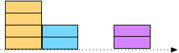

App for Learning Fourier Transform
===============
Department of Informatics, Kyushu University 
IKEDA, Daisuke (daisuke@inf.kyushu-u.ac.jp)

# Introduction
I've developed this app based on experience of my class for
juniors or seniors in Physics Department, Kyushu University,
aiming that I'd like to deliver basic ideas of Fourier Transformation.

Fourier Transformation or Fourier Series are written by mathematical notations,
such as integrals, infinite series, trig functions,
which are difficult to understand for kids.
But, we experience  phenomena in our daily lives, closely related to Fourier Transformation,  such as rainbows. 
Therefore, once we can understand basic ideas, I expect we can create interesting
science lessons for kids.

Anyone can use this app freely. If someone who publishs academi papers, I kindly request that you cite the following paper:
> Daisuke Ikeda: "LESSONS ON INFORMATION IN TERMS OF THE FOURIER TRANSFORM FOR PRIMARY-AGED STUDENTS", Proceedings of the 12th annual International Technology, Education and Development Conference (INTED2018), pp. 3734-3739, 2018.

# Install and How to use
0. Put downloaded files somewhere under a Web server and access to the corresponding URL, using a browser of a smart-phone, tablet, or PC. Or you can use [App on a server at Kyushu Univ.](https://rebrand.ly/sendi07afc).
1. Figure out a shape of "Source", using ▲ and ▼ buttons.
2. Pushing "Calculate!" button, you can see the number (co-efficient) of 4 basic blocks (base vectors), where these basic blocks are (1, 1, 1, 1), (1, 1, -1, -1), (1, -1, -1, 1), and (1, -1, 1, -1). For example, when the number of the 1st basic block is 2, then the height of the first four blocks of "4 Basic Blocks" are 2.
3. Pushing "Composite" button, it computes the sum of 4 basic blocks and displays the result at "Received". In this computation, only checked basic blocks are used. If all basic blocks are checked, "Received" are the same as "Source".
4. If there are unchecked basic blocks, "Received" and "Source" are not the same, and the difference is displayed at "distance". The more basic blocks you use, the more similar "Received" you get.

# For teachers who use the app
The whole story is that, assuming a sender and a receiver, the sender creates a shape of blocks, represents it by four digits, and sends them. You see the created shape at "Source", represented 4 digits at "4 Basic Blocks", and the received shaped by combining 4 digits (in the sense of vectors) at "Received".

Since shapes at "Source" is considered as digitized signals, we can use heights of blocks as a representation. But, we represent shapes with another representation. More precisely, using averages of the total heights and some combinations of two blocks, called basic blocks, we can represent exact shapes.

Using the following example, I'll explain it. In case that "Source" is (4, 2, 0, 2), basic blocks and received one are displayed as follows:

The following picture is "Source" part of the above example:

The first basic block, represented by (1, 1, 1, 1), shows the average of four blocks in "Source". For example, if "Source" is (4, 2, 0, 2), then the first basic block will be 2*(1, 1, 1, 1), where 2 = (4 + 2 + 0 + 2)/4, the average. You see 2 at the top of the first basic block, pushing "Calc!" button. Therefore, if we send 2, the receiver would figure (2, 2, 2, 2) is the original shape, like the red-line block in the following picture.

The second basic block, represented by (1, 1, -1, -1), shows the differences between the total average above and the left/right halves of "Source" blocks. In the above example, the left half is (4, 2) and the right one (0, 2), and their averages are 3 and 1, respectively. The transparent blue block, (3, 3, 1, 1) represents them. The differences of them against the total average 2 are 1 and -1, respectively. An important point is that we represent it by (2, 1), not (2, 1, -1) because, in **any** cases, absolute values of these differences are the same. In this example, absolute values of 1 and -1 are 1, up- and down-arrows in blue. If these differences are -2 and 2, then we represent them by -2.

Similarly, the third basic block (1, -1, -1, 1) represents two averages of the outer two blocks and inner two blocks, and the fourth one those of the (1st, 3rd) pair and the (2nd, 4th) pair.

You may think that these calculations would be tedious. But, you can easily get these values by just an inner product of the original shape (vector) and each basic block.

Even if these calculations are not tedious, you may think why we have to that. This is because this representation can be used for information compression. The fist basic blocks show the total average of the original shape, representing a rough shape of the original shape. In this basic block, all elements are positive. On the other hand, elements in another basic block are both positive and negative, which can represent more detailed shapes. In the second and the third basic blocks, we have the same sign every two elements, while in the fourth one, we have the same sign every element. This means that the fourth basic block have higher frequency, meaning it depicts the most detailed shape. However, our vision and hearing senses can recognize within some range of frequencies, so we can not tell an approximated shape from the original shape even if we'd eliminate digits whose frequencies are higher than our limits.
